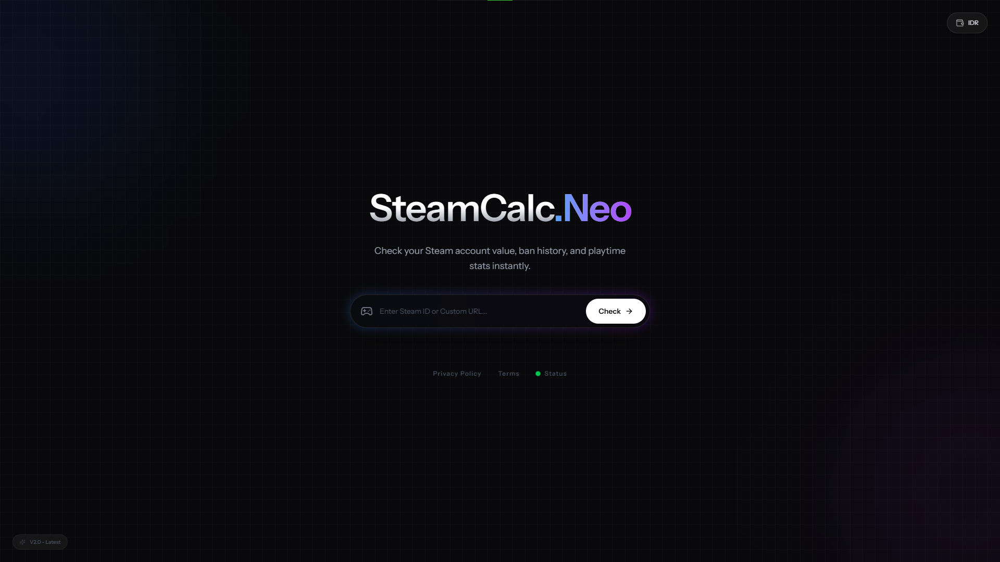
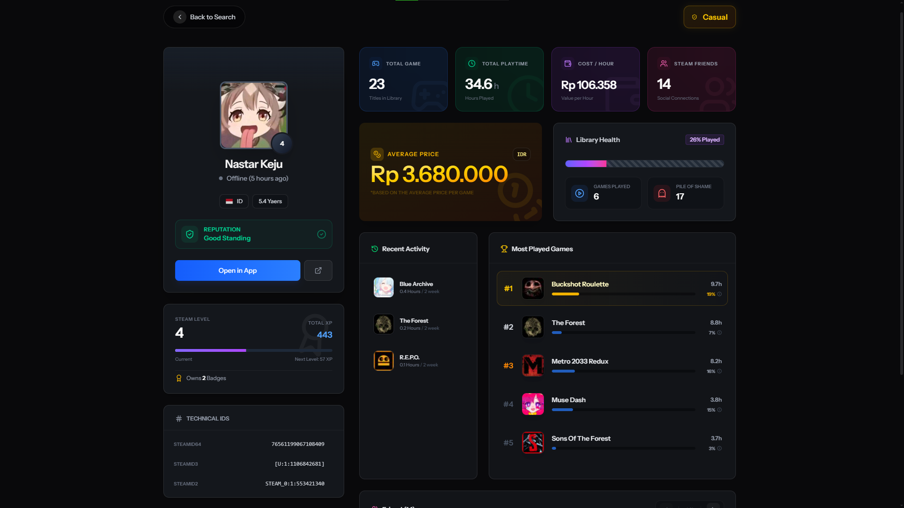

<div align="center">
  <a href="https://github.com/nidnightexe/steam-calc">
    
  </a>

  <h1 align="center">Steam Calc</h1>

  <p align="center">
    <strong>Analisis Statistik & Valuasi Akun Steam</strong>
    <br />
    Aplikasi web modern untuk menghitung dan memvisualisasikan statistik profil Steam menggunakan Laravel dan React.
    <br />
    <br />
    <a href="#-fitur">Fitur</a> ·
    <a href="#-teknologi">Teknologi</a> ·
    <a href="#-instalasi">Instalasi</a> ·
    <a href="https://github.com/nidnightexe/steam-calc/issues">Lapor Bug</a>
  </p>

  <p align="center">
    
    
    
  </p>
</div>

---

## 📸 Tampilan Aplikasi

Berikut adalah antarmuka dari **Steam Calc** yang dirancang dengan fokus pada pengalaman pengguna (UX) yang bersih.

| Halaman Login | Dashboard Utama |
|:---:|:---:|
|  |  |
| *Autentikasi Aman* | *Statistik Real-time* |

---

## 📖 Tentang Proyek

**Steam Calc** adalah alat yang memungkinkan pengguna untuk melihat statistik mendalam mengenai akun Steam mereka. Proyek ini dibangun untuk mendemonstrasikan integrasi yang mulus antara backend PHP yang kuat dan frontend reaktif.

Fitur utama meliputi:
* 🔐 **Autentikasi Aman:** Menggunakan sistem autentikasi bawaan Laravel.
* 📊 **Kalkulasi Aset:** Menghitung estimasi nilai akun berdasarkan game yang dimiliki.
* ⚡ **Performa Tinggi:** Dibangun di atas arsitektur modern Laravel + React.

---

## 🛠 Teknologi

Proyek ini dibangun menggunakan stack modern (TALL/VILT stack variant):

| Komponen | Teknologi | Keterangan |
| :--- | :--- | :--- |
| **Framework** | [Laravel](https://laravel.com) | Backend PHP yang ekspresif dan elegan. |
| **Frontend** | [React](https://reactjs.org) | Library JavaScript untuk membangun antarmuka pengguna. |
| **Starter Kit** | Laravel Starter | Setup modern dengan integrasi React. |
| **Testing** | [Pest](https://pestphp.com) | Framework testing PHP yang elegan. |

---

## 🚀 Instalasi

Ikuti langkah-langkah berikut untuk menjalankan proyek ini di mesin lokal kamu (Localhost).

### Prasyarat
Pastikan kamu telah menginstal:
* PHP >= 8.2
* Composer
* Node.js & NPM

### Langkah-langkah

1.  **Clone Repositori**
    ```bash
    git clone [https://github.com/nidnightexe/steam-calc.git](https://github.com/nidnightexe/steam-calc.git)
    cd steam-calc
    ```

2.  **Install Dependencies**
    Install paket backend dan frontend:
    ```bash
    composer install
    npm install
    ```

3.  **Setup Environment**
    Salin file `.env.example` menjadi `.env` dan konfigurasi database kamu:
    ```bash
    cp .env.example .env
    php artisan key:generate
    ```

4.  **Setup Database**
    Jalankan migrasi untuk membuat tabel database:
    ```bash
    php artisan migrate
    ```

5.  **Jalankan Aplikasi**
    Kamu perlu menjalankan dua terminal terpisah:

    *Terminal 1 (Laravel Server):*
    ```bash
    php artisan serve
    ```

    *Terminal 2 (Vite Development):*
    ```bash
    npm run dev
    ```

Buka browser dan akses `http://localhost:8000`.

---

## 🧪 Pengujian (Testing)

Proyek ini menggunakan **Pest** sebagai framework pengujian. Untuk menjalankan test suite:

```bash
php artisan test